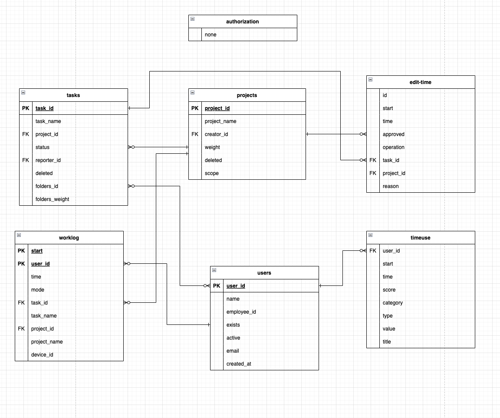

# Time Doctor 2 Extractor

There are two json files for this extractor. One is for initial load and the second one is for increments.
These two files differ in only one parameter and that is "from" in endpoints which support date range when called.
It is recommended by TimeDoctor 2 API Docs to not use time window of more than 7 days, but test showed that a whole month can be downloaded at once.

# Configuration

User has to define an account to login with. This is a combination of email and password.
This account is used to retrieve token which is used as a parameter in all API calls.

- `email` (string):
parameters.api.authentication.loginRequest.params.email
- `password` (string - secured):
parameters.config.#password
- `datetime-from` (optional, string - ISO datetime format):
parameters.config.datetime-from - example: `2022-07-01T00:00:00.000Z`
- `datetime-to` (optional, string - ISO datetime format):
parameters.config.datetime-from - example: `2022-07-01T00:00:00.000Z`

## Table output

## Extractor Logic

1. Get auth token from /login endpoint

1. Get company ID from /authorization endpoint

3. Get list of users from /users endpoint

4. Use the list of users to iterate over /activity/worklog, activity/edit-time and /activity/timeuse endpoints. Both of these require specification of date range using “from” and/or “to” params in ISO datetime format.  

5. Consume data from /projects and /tasks endpoints.
 